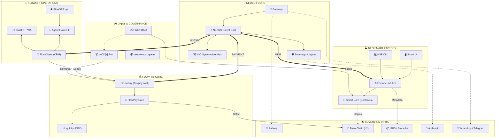

NEØ PROTOCOL



```mermaid
graph TB
    subgraph NEOBOT["🧠 NEOBOT CORE"]
        GATEWAY["🚀 Gateway"]
        NEXUS["⚡ NEXUS (Event Bus)"]
        MIO["🆔 MIO System (Identity)"]
        ADAPTER["🛡️ Sovereign Adapter"]
        GATEWAY --> NEXUS
        NEXUS <--> MIO
        NEXUS <--> ADAPTER
    end

    subgraph OPERATIONS["💼 FLOWOFF OPERATIONS"]
        FLOWCLOSER["💬 FlowCloser (CRM)"]
        AGENT_FO["🤖 Agent FlowOFF"]
        LANDING_FO["🌐 FlowOFF.xyz"]
        PWA_FO["📱 FlowOFF PWA"]
        LANDING_FO --> AGENT_FO
        AGENT_FO <--> FLOWCLOSER
        PWA_FO <--> FLOWCLOSER
    end

    subgraph FACTORY["🏭 NEO SMART FACTORY"]
        SF_HUB["⚙️ Factory Hub API"]
        SF_CORE["📜 Smart Core (Contracts)"]
        SF_CLI["💻 NSF CLI"]
        SF_UI["🖥️ Smart UI"]
        SF_UI --> SF_HUB
        SF_CLI --> SF_HUB
        SF_HUB --> SF_CORE
    end

    subgraph FINANCE["💰 FLOWPAY CORE"]
        FP_GATE["💸 FlowPay (flowpay.cash)"]
        FP_CORE["🧠 FlowPay Core"]
        FP_LIQ["💧 Liquidity (DEX)"]
        FP_GATE --> FP_CORE
        FP_CORE --> FP_LIQ
    end

    subgraph PRODUCTS["🎮 DApps & GOVERNANCE"]
        FLUXX["⚖️ FluXX DAO"]
        WOD["🏋️ WOD[x] Pro"]
        NEO_LAND["🌍 neoprotocol.space"]
        FLUXX -.-> WOD
    end

    subgraph INFRA["☁️ SOVEREIGN INFRA"]
        RAILWAY["🚂 Railway"]
        BASE["🔵 Base Chain (L2)"]
        IPFS["📦 IPFS / Storacha"]
        LLM["🧠 Anthropic"]
        WA["💬 WhatsApp / Telegram"]
    end

    NEXUS == "PAYMENT" ==> FP_GATE
    NEXUS == "MINT" ==> SF_HUB
    NEXUS == "NOTIFY" ==> FLOWCLOSER
    GATEWAY -.-> WA
    GATEWAY -.-> RAILWAY
    ADAPTER -.-> LLM
    FLOWCLOSER -- "Leads" --> FP_GATE
    FP_CORE -- "Settle" --> BASE
    SF_CORE -- "Deploy" --> BASE
    SF_HUB -- "Metadata" --> IPFS
    WOD -- "Rewards" --> FP_GATE
    FLUXX -- "Rules" --> SF_CORE
```

> 🔭 [Stack Analyzer — live view](https://dashboard.neoprotocol.space/stack-analyzer.html)


```
      ▄
  ▄██▄
 █  █ █░
 █ █░ █
  ▀██▀
  ▀░
```


 NEØONE ENTERPRISE ░░ DEX.HUB
